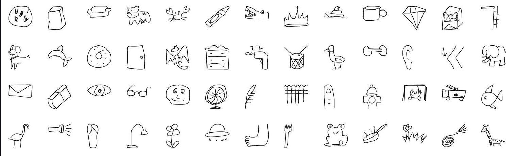

# drawNN

This project aims to use machine learning algorithms to draw cartoon like images of photos captured by your phone.
The data that will be used in this project comes from https://github.com/googlecreativelab/quickdraw-dataset,
which includes millions of labeled drawings from the game Quick, Draw!. 

I'm thinking of the following approach to achieve this:
1. Photo is captured and sent in as a parameter to the main algorithm.
2. Some sort of object classification algorithm is used to detect the objects in the image, outputting their labels and dimensions.
3. The labels and dimensions of the objects in the picture are given as parameters to our trained model, which then generates drawings of these objects.

## Challenges

A particular challenge will be for our model to draw images that have the correct orientation. For example, if our picture includes a picture of a chair taken from the side, we don't want our model to draw a front facing chain. As of yet, I am not sure how we will train such a NN to generate drawings of objects that are consistent with both their original orientation and dimensions in the picture. But I am hopeful we can achieve this.

## Stages of development

- As a beginning level task, I will try to implement a program that using the object classification algoritm, ir will randomly return images of the labeled objects from the collection of labeled images that we have. This will probably be easy and fun.
- Then, we will actually train our NN to give us, or generate for us, a better drawing of the object taking into account its relative dimensions and orientation. This will obviously be the hard part and the gist of our program. 

## Objectives

- pipeline a series of AI models achieving different tasks to create the desired result.
- learn to utilize an AI image classification model as part of an application.
- form a reasonable training dataset from millions of data points
- learn how to use ML to generate content/image

